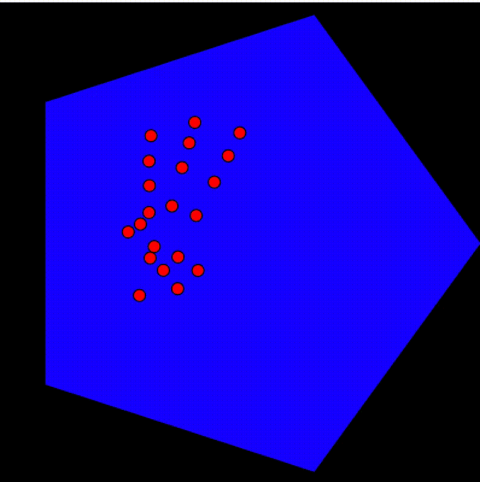

# Homework 4 - Other ML Models

When given data from an ML model such as HandPose, can we use this data in a way to make informed decisions about whether fingers are up or down? This seems like something that could be pretty useful to figure out, especially if one wanted to create a game that relied on counting how many fingers a person has up or down.

For that reason I wanted to try to make use of data to try to count fingers, a thing you learn in preschool.

### Definitions

Because the computer has no clue what it means to have a finger up and only sees a stream of numbers I decided to make the decision that a finger is "up" if the `y` coordinates of the finger as provided by HandPose go up in a linear fashion (in the negative y direction on the p5js canvas).

In other words, a finger is "up" if all the y values go from greatest to least. In es6 JavaScript, we can write this as:

```js
isUp = annotations[key]
  .slice(1)
  .every(([_x, yVal, _z], i) => yVal < annotations[key][i][1]);
```

This works by temporarily removing the first element of the array and checking that, for every yValue within a finger, the y value at `i` (which in this case is not the same position as the value we are looking at since we removed the first value) is greater than the current one. If this holds, we return true, otherwise we return false.

### Caveats

This looks great and all, but when we use this on our thumbs it may have unintended consequences. When a thumb is "down" it may still have strictly linearly decreasing `y` coordinates, but maybe we can add a rule to make sure it works.

One thing I noticed is that we can use the `x` value for the thumb in conjunction with the `y` value. If we can be confident that the `x` value is increasing or decreasing (but not both) for the entire finger, it should be up.

This can be represented in es6 Javascript as:

```js
isUp =
  annotations[key]
    .slice(1)
    .every(
      ([xVal, yVal, _z], i) =>
        yVal < annotations[key][i][1] && xVal > annotations[key][i][0]
    ) ||
  annotations[key]
    .slice(1)
    .every(
      ([xVal, yVal, _z], i) =>
        yVal < annotations[key][i][1] && xVal < annotations[key][i][0]
    );
```

This code can be read the same as above. Essentially we check if the thumb is going in the `-y` and `+x` directions (this should work for our right hand), and then if that isn't true we check if it is going in the `-y` and `-x` directions (which should cover our left hand).

The following is a gif of this in action where you can see the number increase and decrease as I raise and lower my fingers.


### Now what?

Good question. I am not the most creative soul but I thought it would be interesting to do something pretty simple like control the sides of a polygon. So I setup a polygon method that draws N sides and then let the fingers control the number of sides that are being drawn to the canvas. Pretty simple stuff.



## Data and Model Biography

HandPose is a super cool library and it has many really great use cases, however one thing it is missing is a Model and Data Biography. For this reason I did a bit more research to see what it came from.

According to the node module on npm published as [`@tensorflow-models/handpose`](https://www.npmjs.com/package/@tensorflow-models/handpose), handpose comes from Google's [MediaPipe](https://google.github.io/mediapipe/solutions/hands) library of multimodal applied ML pipelines. MediaPipe includes many solutions such as:

- face detection
- face mesh
- iris tracking
- holistic pipelines for simultaneous pose, face and handtracking to yield 540+ landmarks
- selfie segmentation (for selfie effects and video conferencing)
- hair segmentation (for cool colored hair filters i guess)
- 3d object detection
- automatic video cropping
- and more

Google's Blog posted about MediaPipe's hand tracking capabilities back in August 2019 with [this blog post](https://ai.googleblog.com/2019/08/on-device-real-time-hand-tracking-with.html). Google uses a [single-shot detector model](https://arxiv.org/abs/1512.02325) called BlazePalm to efficiently handle real time images by detecting palms and creating an oriented bounding box for the hand.

Next they have a Hand Landmark model that was trained on "~30K real-world images with 21 3D coordinates." Below is an example provided by them in their sample data


Note that the top images are aligned hand crops, and the bottom are rendered synthetic hands (not from images)

To set the landmarks, the hands were manually annotated. In this blog I couldn't find any information on where the images come from outside of the fact that they used real-world photos. Because it was produced by google, I'm going to assume that the real-world training data came from their massive image repositories.

With this data it is likely enough to come up with a useful model and data biography with the exception of the datasource (unless saying google is enough).

From all of this, I wonder if there is a reason ml5 doesn't provide the gesture recognition algorithm (since it seems to be included and covers my entire counting issue for multiple cultures, something I didn't even think about).

I think that this understanding of the provenance of the model makes me wonder what else we could do with just hands. Can we track multiple hands? There is so much to be explored
