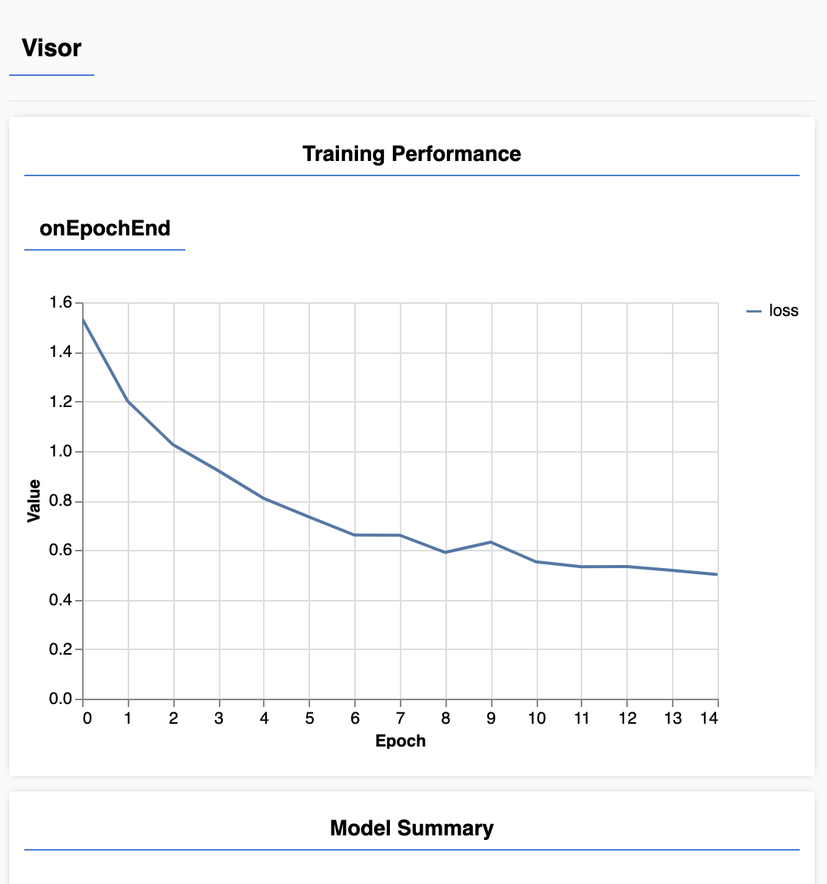
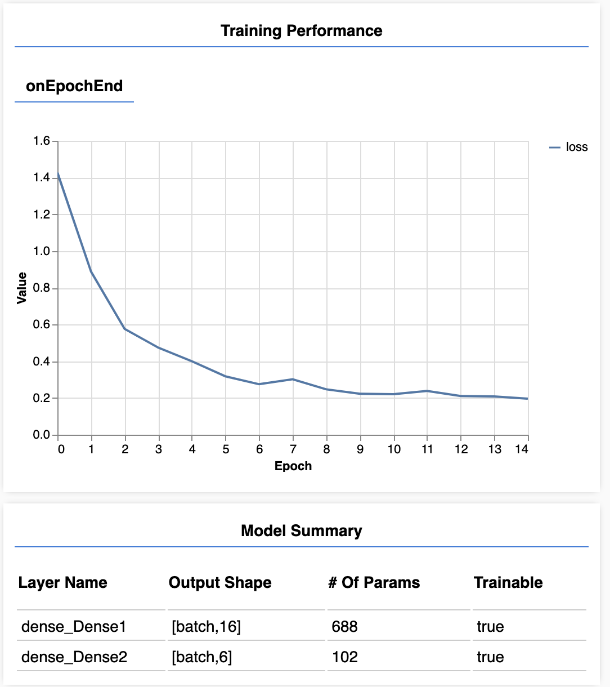

# Homework 5 - Training My Own Model

### Machine Learning for Human Creative Practice

In the talk by Dr Rebecca Fiebrink, she poses the question, "How can machine learning support people's existing creative practices? Expand people's creative capabilities?"

I believe that Machine Learning opens the door for brand new art forms that haven't been imagined yet. While we may want to make things like generative art or use style transfer to make one thing into something else, there is a new world of possibilities outside of that since the computer is only limited by the creativity of the person controlling it. On top of that, people will be inspired by other's creative works and may attempt to create their own using machine learning and other computational techniques. This all has the potential of causing major artistic growth.

### My Own Creative System

I, for one, don't consider myself to be the most creative person, but I think it would be interesting to experiment with sound and drawing to a canvas some kind of generative album cover based on the computers prediction of what kind of genre it is. This would likely require the use of multiple models so it could calculate musical genre from a single audio input. There could be many genre outputs and then taking those genre outputs to create a brand new album cover that is similar to those of that genre. This is somewhat inspired from the talk by Dr Fiebrink, and while it could be tough to make this real time, I think it could be very interesting to see.

### My New Sketch

For this week I decided to attempt to recreate my last week's project by training a neural network to detect how many fingers are raised. To start, I simply duplicated my existing sketch and used the handpose example from class as a way to see how to properly translate things over and set things up.

Since we would be working with many more points (42 of them) I needed a way to take our handpose data and flatten it out into an array containing the numbers corresponding to where the points on my hand were located. To do this, I came up with this:

```js
function flattenHandValues(handvalues) {
  return Object.keys(handvalues).reduce((res, key) => {
    return [
      ...res,
      ...handvalues[key].reduce((res, currentPoint) => {
        return [...res, currentPoint[0], currentPoint[1]];
      }, []),
    ];
  }, []);
}
```

This takes our handvalues and for each finger adds the values of a flattened array containing the `x` and `y` coordinates of the points on my hand to it. This gives us an array of all the values that we want to send to our model as inputs to train on.

Also I found the data collection process to be very long and tedious so I added a way to save the data to a json file after I finished collecting it. This makes things easier and allows the model to be used by anyone without explicitly training it from scratch.

Below is a graph of the loss from when I trained the full model for the first time.



When I tried recording data a second time I was suprised to find my data collection was not saved to my p5 filesystem but instead saved to my computer. Then after trying to load that data into the p5 editor, my browser decided to freeze. I decided at that point to just start over. Because I would like to try to fix the loading later I put the data into a file on the p5js editor filesystem but didn't try to load it.

After my frustrating data experience and reloading my training data this was my new loss. It was a bit better but still could use some work.



Unfortunately the biggest hit I had was that the model could only count to 4 and refused to recognize I had five fingers up whenever I had 5 raised.


I believe this has to do with the fact that it is putting more emphasis on the numbers coming in from my non-thumb fingers since the thumbs position is somewhat variable there. Maybe providing more data for 5 fingers up could make a difference but this was a disappointing end to an attempt to improve my last weeks code.
