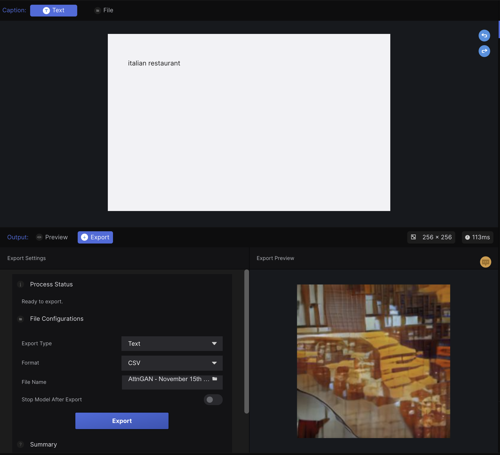

# Homework 8 - Pre-trained models with Runway

In class I worked with an AttnGAN model that takes text as input and generates an image of the text that was inputted.

Since I had played around with the model's text to image capabilities in class, I decided to see what happens when you try to export the model. When I switched output to `Export`, however I was greeted with a message that said

> This model doesn't support exports from the web. Download Runway for desktop to export from this model

I then downloaded the desktop app and installed it. After logging in, creating a new workspace and loading the model. I was greeted with an export feature that lets me export data in csv format to my documents folder.

The export took a little bit of time so while I wait I'll write up a little model biography for this model.

## Model Biography

#### Description

Attentional Generative Adversarial Networks (AttnGAN) allow for fine-grained text-to-image generation. By paying attention to relevant words it can synthesize images directly from text.

#### Developer and Year

AttnGAN was developed by Microsoft Research by Tao Xu, Pengchuan Zhang, Qiuyuan Huang, Han Zhang, Zhe Gan, Xiaolei Huang, Xiaodong He in 2018.

#### Purpose and Intended Users

While there isn't a direct need for text to image generation, it is very useful for research in the field of image synthesis and also can be used by artists who are using AI in their works.

#### References

Research Paper: https://openaccess.thecvf.com/content_cvpr_2018/papers/Xu_AttnGAN_Fine-Grained_Text_CVPR_2018_paper.pdf

Github Repository: https://github.com/taoxugit/AttnGAN

## The final Export results.

After realizing I was stupid and needed to change my inputs a couple times I managed to add a row to the export. What it contains is a csv with the time or the request and a base64 representation of the image result. I could see this being used for generating a simple collection of images and then displaying them and knowing where they came from. Unfortunately though, this doesn't give the input values so that would need to be handled on the user's end.

###
