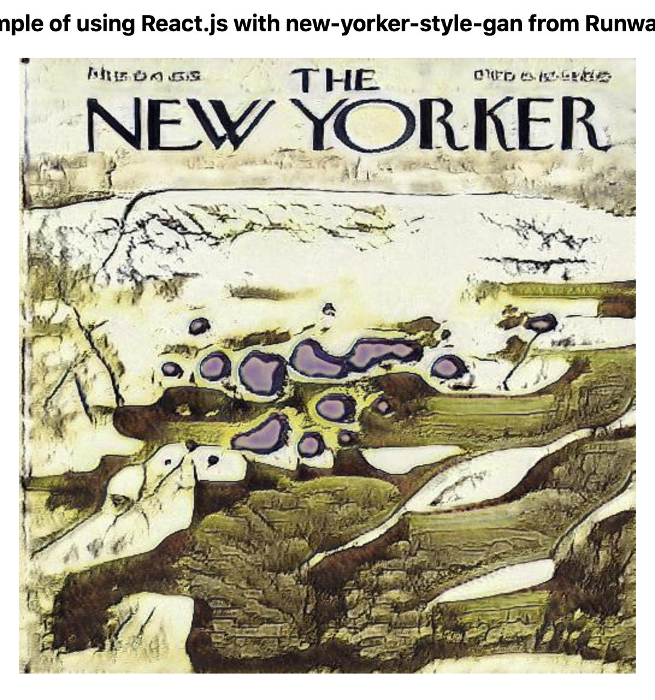

# Homework 9 - RunwayML Generative models

Since I use React for work and pretty frequently, I thought it would be a neat idea to set up a full stack react app that generates random New Yorker covers.

To do this is pretty simple but didn't come very easily since I would need a good way to setup a backend server that generates the images and a frontend that will fetch them and display them.

### What I used

To do this, I used Next.js. Next is one of my favorite react frameworks and provides just the right tools that we need to make this work.

First, it includes built-in api routes. What does this mean?

This means that we can write the code for our backend in the same area as the frontend. That way I won't have to play tug-of-war with CORS issues and such when it comes time to deploy it.

Next, it has very useful image components that optimize rendering and can handle base64 images quite smoothly.

With both of these things at my advantage I got to work building a backend endpoint that can send an object containing the base64 of the image to the frontend, and a frontend that can render it all.

### The backend.

The backend is nearly identical to the express backend in class with a couple differences.

First, it isn't technically using `express.js`, Next's backends use a similar format but endpoints are handled per-file. So if I create a file called `model.js` in the folder `api`, I can visit `http://localhost:3000/api/model` and my endpoint will respond with the data I want.

Next, instead of populating the input values with a for loop, I used a newer `Array.from` method that lets you pass in properties and call a function on each value.

Below is the code from my backend.

```js
export default async (req, res) => {
  const model = new HostedModel({
    url: "https://new-yorker-style-gan-e7697fe9.hosted-models.runwayml.cloud/v1/",
    token: process.env.RUNWAY_TOKEN,
  });

  const inputs = {
    z: Array.from({ length: 512 }, () => Math.random()),
  };

  const { image } = await model.query(inputs);

  // Use the following to send image to endpoint
  // const decoded = image.replace("data:image/jpeg;base64,", "");
  // const buffer = Buffer.from(decoded, "base64");

  // res.writeHead(200, {
  //   "Content-Type": "image/jpeg",
  //   "Content-Length": buffer.length,
  // });

  // res.end(buffer);

  res.status(200).json({
    model: "new-yorker-style-gan",
    image,
  });
};
```

You may notice I have some commented out lines of code. What are these?

They were my first attempt at writing the file to respond with an actual rendered image rather than the base64 representation. In other words, when you directly visit the endpoint, it would appear as if it was an image file rather than a json object.

I feel that if I had worked a little harder I may have been able to use this instead, but I am happy with what came to be with my work here.

## The Frontend

The frontend for this project is written in React. For those who are unfamiliar with it, it is a javascript web framework that renders websites using JSX, an html-like representation of the page in pure javascript.

My first iteration of the page, used a feature of NextJS called server-side rendering. With this I would gather the values I wanted to render on the page on the server side, rather than on the side of the client. This gives the page a faster feeling in some cases, however I had trouble with this when it came to deployment so only a portion of this code remains and can be seen below

```js
export async function getServerSideProps(ctx) {
  // const { model, image } = await fetch(
  //   `${ctx.req.headers.referer}/api/model`
  // ).then((res) =x> res.json());

  return {
    props: {
      // model,
      // image,
      url: `https://${ctx.req.headers.host}/api/model`,
    },
  };
}
```

In place of this I used React hooks to fetch the file and set the data on the page.

The final result can be seen below:

```js
export default function Home({ url }) {
  const [image, setImage] = useState("");
  const [model, setModel] = useState("");

  useEffect(async () => {
    const { model: modelName, image: imageUrl } = await fetch(url).then((res) =>
      res.json()
    );

    setImage(imageUrl);
    setModel(modelName);
  }, []);

  return (
    <div className={styles.container}>
      <Head>
        <title>IMA ML</title>
        <link rel="icon" href="/favicon.ico" />
      </Head>

      <main className={styles.main}>
        <h1 className={styles.title}>IMA ML</h1>
        <h3>Example of using React.js with {model} from RunwayML</h3>

        {image && (
          <Image unoptimized src={image} alt={model} width={512} height={512} />
        )}
      </main>
    </div>
  );
}
```

This may be unfamiliar to some so let me give a minor tour of the code.

First we have the function `Home`. This function is a React component that is passed a `url` that we want to fetch from. It essentially contains what we want to render to the page.

Next we have two `useState` hooks. These allow us to control values as the state of the page changes, for instance when we receive the image from the asynchronous method below. They return an array with the value and a function that updates said value.

Next we have a `useEffect` hook. This is a hook that runs a function when something changes. This list is denoted by the array at the end of it, however ours is empty since we only want it to run when the page loads.

Inside the hook, we have a fetch method that awaits a response from our `url` we passed and then destructures that response into two values: `model` and `image`, which are then renamed `modelName` and `imageUrl`. We use these to update the states of the values above.

Finally we have the html that renders the page. The only thing to note is the line that reads:

```js
{
  image && (
    <Image unoptimized src={image} alt={model} width={512} height={512} />
  );
}
```

What this does is that it renders the image IF the image exists, if it doesn't we don't show the image.

## Results

The final website can be viewed here: https://ml-for-arts-runway-es4753.vercel.app/

The code for it can be viewed here: https://github.com/esilverm/ima-runway-react

Below are some examples of generated images using random numbers




